# openECSC 2024 - Round 2

## [rev] arxelerated (21 solves)

oh no, my device starts shredding everything I put in it...

```bash
$ qemu-system-arm -cpu cortex-m3 -machine lm3s6965evb -kernel arxelerated -semihosting -semihosting-config enable=on,target=native -serial mon:stdio
```

Writeup author: <@kristoj>  
Challenge author: <@Rising>

## Table of contents
- [Introduction](#introduction)
- [First impression](#first-impression)
- [Understanding the flow](#understanding-the-flow)
  - [Initial static analysis](#initial-static-analysis)
  - [Dynamic analysis](#dynamic-analysis)
  - [Undefined instruction handling](#undefined-instruction-handling)
- [Deobfuscation](#deobfuscation)
  - [BL instruction offsets](#bl-instruction-offsets)
  - [Patching the binary](#patching-the-binary)
- [Reverse engineering](#reverse-engineering)
  - [Main loop](#main-loop)
    - [sub_4AC](#sub_4ac)
- [Solving the encryption](#solving-the-encryption)
  - [Dependency Analysis](#dependency-analysis)
  - [Z3 solver](#z3-solver)
  - [Patching the screen buffer](#patching-the-screen-buffer)
- [Summary](#summary)
- [Attachments](#attachments)

## Introduction

A really fun challenge about an obfuscated ARM kernel. It's an engaging puzzle for those familiar with firmware analysis.

**Note:** You can skip to the summary if you are not interested in the details.

## First impression

By examining the provided materials, we encounter two main files:

- `arxelerated`: A firmware file for ARM Cortex-M3.
- `out.enc`: An encrypted file, presumably containing data we need to decrypt.

Executing the firmware using the specified QEMU command reveals a beautifully rendered cat image.

<div style="text-align: center;">
    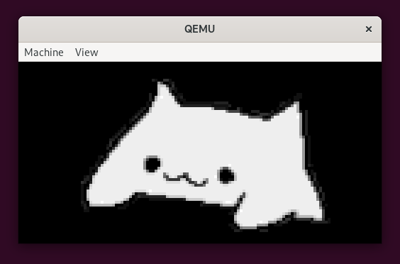
</div>

Upon entering a key, numerous dots begins to appear on the console while the image is being covered with random pixels. Once the image is fully obscured, a lenghty hexadecimal string is outputted on the console. 

<div style="text-align: center;">
    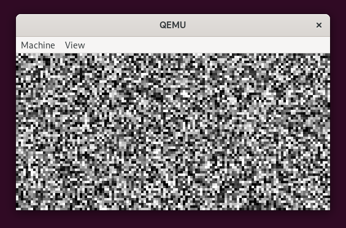
</div>

```
>........[...].........
d0f5d8cadc1abc0b[...]6b6b33eb
```

The length of the hex string matches that found in the `out.enc` file, and its prefix coincides with the beginning of the encrypted file.
Repeated executions of the QEMU command confirm the hex string's consistency, suggesting deterministic encryption. It's plausible to infer that the out.enc file encrypts data related to the challenge's objective, possibly the flag.

## Understanding the flow

### Initial static analysis
By executing the file command on the arxelerated file, we ascertain that it is an ARM ELF binary, characterized by the following properties: 

```bash
$ file arxelerated
arxelerated: ELF 32-bit LSB executable, ARM, EABI5 version 1 (SYSV), statically linked, not stripped
```

Further examination with the strings command reveals that the binary was compiled with the Sourcery G++ 4.2-68 compiler and utilizes functions related to an OSRAM display:

```bash
$ strings arxelerated | grep GCC
GCC: (Arm GNU Toolchain 13.2.rel1 (Build arm-13.7)) 13.2.1 20231009
GCC: (Sourcery G++ 4.2-68) 4.2.1
GCC: (Sourcery G++ 4.2-68) 4.2.1
GCC: (Sourcery G++ 4.2-68) 4.2.1
GCC: (Sourcery G++ 4.2-68) 4.2.1

$ strings arxelerated | grep OSRAM
OSRAMWriteCommand
OSRAMWriteData
g_pucOSRAM128x64x4VerticalInc
g_pucOSRAM128x64x4HorizontalInc
g_pucOSRAM128x64x4Init
OSRAM128x64x4Clear
OSRAM128x64x4ImageDraw
OSRAM128x64x4Enable
```
<br>

Opening the binary in IDA PRO with the ARM little-endian processor type provides a closer look at its structure:

<div style="text-align: center;">
    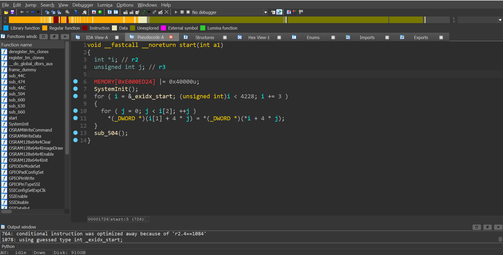
</div>
<br>

The `start` function primarily initializes the system and then calls the `sub_504` function, which performs several critical operations:

1. `sub_474`: Initializes the clock and display.
2. `OSRAM128x64x4ImageDraw(&unk_20000004, 0, 0, 128, 64)`: which, we can assume, draws the cat image on the display.
3. `UARTCharPut(0x4000C000, '>')`: Outputs the > character on the console.
4. `UARTCharGet(0x4000C000)`: Awaits a character input from the console.
5. `__und(0)`: Triggers an *undefined (UDF) instruction*, leading to an exception. 

<div style="text-align: center;">
    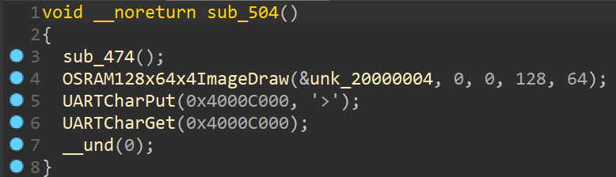
</div>
<br>

Because of the *UDF instruction*, we can not understand what the program does only by a static analysis. Let's use GDB to debug the binary and see what is happening. 

### Dynamic analysis
Due to the *UDF instruction*, static analysis alone is insufficient. We proceed with dynamic analysis using GDB connected to a QEMU instance configured to halt at startup, by adding the `-S -s` flags to the QEMU command. 

```bash
$ qemu-system-arm -cpu cortex-m3 -machine lm3s6965evb -kernel arxelerated -semihosting -semihosting-config enable=on,target=native -serial mon:stdio -S -s
```

```
$ gdb-multiarch 
> file arxelerated
> target remote localhost:1234
> break *0x54A
> continue

> x/i $pc
=> 0x54a <frame_dummy+290>:     udf     #0

> next

> x/i $pc
=> 0x6cc <frame_dummy+676>:     tst.w   lr, #4
```
<br>

We can see that the program jumps to the `sub_6CC` function that handles the interrupt, like an **Interrupt Service Routine**. Here, the *Current Program Status Register (CPSR)* is saved and it is used to call a function pointed by `off_F80`. We can assume that this is the **IRQ vector table**.

<div style="text-align: center;">
    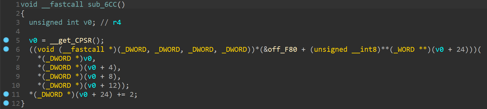
</div>
<br>

In this case, when the execution reaches the *BLX instruction* at `0x708`, the program jumps to the `sub_600` function, which is the first function in the **IRQ vector table**:

```bash
> break *0x708
> continue

> x/i $pc
=> 0x708 <frame_dummy+736>:     blx     r5

> next

> x/i $pc
=> 0x600 <frame_dummy+472>:     push    {r4}
```
<br>

Because of the *UDF instruction* was called with the parameter `#0`, we can guess that this argument represents the index of the function in the **IRQ vector table** that will be called by the handler.  

### Undefined instruction handling
By using *IDA python*, we can extract all the addresses where there is a *UDF instruction* to see if the guess is true.

```python
> 
def get_und_addresses():
    addresses = []
    for i in range(0x0, 0x1000):
        if get_bytes(i, 1) == b'\xde':
            addresses.append(i-1)
    print("UND addresses:")
    print(list(map(hex, addresses)))
    return addresses

def get_und_arguments():
    addresses = get_und_addresses()
    arguments = []
    for address in addresses:
        arguments.append(get_operand_value(address, 0))
    return arguments

def print_und_handlers():
    arguments = get_und_arguments()
    print("UND arguments:")
    print(list(map(hex, arguments)))

> print_und_handlers()

UND addresses:
['0x4c0', '0x4ce', '0x4d8', '0x4f0', '0x4fa', '0x54a', '0x6e0', '0x774']
UND arguments:
['0x1', '0x3', '0x4', '0x3', '0x2', '0x0', '0xff', '0xff']
```
<br>

If we put a breakpoint to this addresses inside **GDB**, we can see that the program jumps to the functions pointed by the **IRQ vector table** at the corresponding index (except for 0xff arguments, whose instruction are never reached). So the guess was correct!  
Furthermore, we can notice that when the program jumps to the functions in the **IRQ vector table**, the registers are the same as the ones during the *undefined instruction*. 

## Deobfuscation

To see some comprehensible pseudo-code from function callers, we aim to replace the *UDF instructions* with calls to their corresponding handler functions. However, there's a problem: the Branch Link (BL) instruction spans 4 bytes, while *UDF instructions* are only 2 bytes long.  
By double-clicking the calculated addresses in the *IDA python* console, we can inspect the *UDF instructions* and see that most of the time they are preceded by a redundant instruction `MOV R3, R3`. This extra space provides an opportunity to insert the *BL instruction*.  

### BL instruction offsets
The *BL instruction* is PC-relative, so we need to calculate the offset between the *UDF instruction* and the function we want to call. 

```python
>
def calculate_BL_bytes(source, destination):
    source = source + 4
    offset = destination - source
    offset = (offset >> 1) & 0x00FFFFFF
    imm11 = offset & 0x07FF

    S = (offset >> 24) & 0x1
    J1 = not(S ^ ((offset >> 22) & 0x1))  
    J2 = not(S ^ ((offset >> 23) & 0x1))

    high_halfword = 0xF000 | (S << 10)
    low_halfword = 0xD000 | ((J1 & 0x1) << 13) | ((J2 & 0x1) << 11) | imm11

    return high_halfword.to_bytes(2, byteorder='little') + low_halfword.to_bytes(2, byteorder='little')
```

After some trial and error, we can see that it returns the correct bytes for the *BL instruction* that will call the function pointed by the destination address. 

### Patching the binary
We can automatize the patching process:

```python
> IRQ_table_addr = 0xF80
> IRQ_table = [0x600 + int.from_bytes(get_bytes(IRQ_table_addr + i*4, 1), 'big') - 1  for i in range(0, 5)]

> UND_addresses = get_und_addresses()
> MOV_R3_R3_bytes = get_bytes(0x4CC, 2)

> patchable_UND_addrs = [addr for addr in UND_addresses if get_bytes(addr-2, 2) == MOV_R3_R3_bytes]
> patchable_UND_args = [get_operand_value(addr, 0) for addr in patchable_UND_addrs]

> 
def patch_UNDs():
    for addr, arg in zip(patchable_UND_addrs, patchable_UND_args):
        print("Patching UND at", hex(addr), "with argument", hex(arg))
        print("Calling function at", hex(IRQ_table[arg]))
        BL_bytes = calculate_BL_bytes(addr-2, IRQ_table[arg])
        for i in range(0, 4):
            patch_byte(addr-2+i, BL_bytes[i])

> patch_UNDs()

```
<br>

While most *UDF instructions* can be patched using the above method, the one at `0x4C0` lacks a preceding redundant instruction to repurpose. Reviewing the surrounding instructions reveals a potential optimization to get some space for the patch:

```assembly
.text:000004AC                 PUSH    {R4-R6,LR}
.text:000004AE                 MOV     R6, R0
.text:000004B0                 MOV     R5, R1
.text:000004B2                 LDR     R2, [R0]
.text:000004B4                 LDR     R3, [R1]
.text:000004B6                 MOV     R0, R2
.text:000004B8                 MOV     R1, R3
.text:000004BA                 MOVS    R4, #0
.text:000004BC                 MOV     R2, R4
.text:000004BE                 MOV     R3, R4
.text:000004C0                 UND     #1
```
<br>


As we can see, the registers R2 and R3 are used to store values pointed by R0 and R1, but then they are overwritten with R4. 
We can load those values directly into R0 and R1 without wasting instructions, by patching the binary like this:

```assembly
.text:000004AC                 PUSH    {R4-R6,LR}
.text:000004AE                 MOV     R6, R0
.text:000004B0                 MOV     R5, R1
.text:000004B2                 LDR     R0, [R0]        ; a1
.text:000004B4                 LDR     R1, [R1]        ; a2
.text:000004B6                 MOVS    R4, #0
.text:000004B8                 MOV     R2, R4
.text:000004BA                 MOV     R3, R4
.text:000004BC                 NOP
.text:000004BE                 BL      sub_614
```
<br>

After updating the interested code with the shortcuts *U*, *C* and *P*, we can see the pseudo-code of the functions `sub_504` and `sub_4AC`:

<div style="display: flex; justify-content: space-between;">
    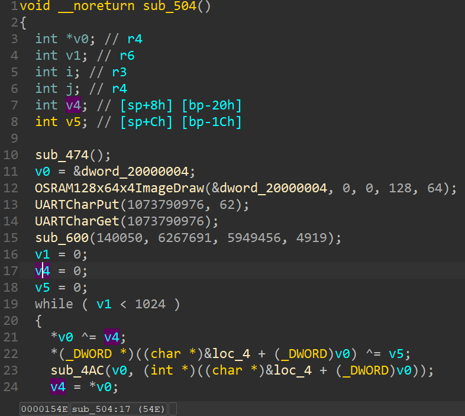
    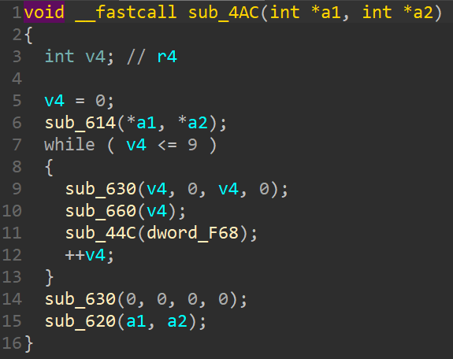
</div>
<br>
And now the challenge begins.
<br><br>


## Reverse engineering

We can give a better look to the `sub_504` function, which is the function called by the `start` function:
- *Initialization*:
<div style="text-align: center;">
    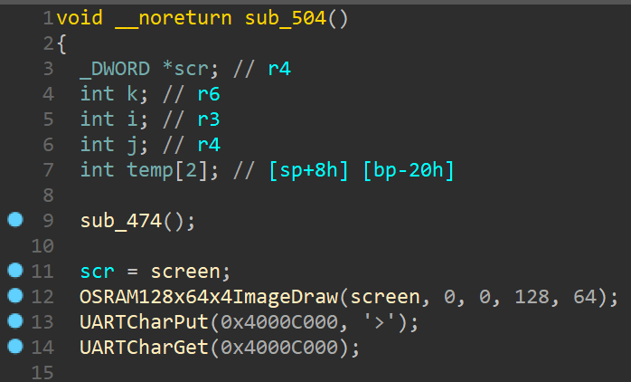
</div>
<br>

- *Main Loop*:
<div style="text-align: center;">
    
</div>
<br>

- *Outputing*:
<div style="text-align: center;">
    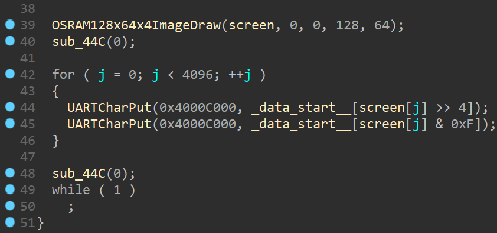
</div>

### Main loop

The loop operates by taking two consecutive 4-byte values from the screen buffer and XORing them with two previously calculated values (initially set to zero). It then passes the result to the `sub_4AC` function and updates the previous values. Subsequently, the loop induces a sleep period, redraws the screen buffer, and updates the indexes.

#### sub_4AC

By analyzing this function, we can notice it is an encryption routine that manipulates the input values through *XOR and ROR operations*. These operations are orchestrated by calling functions from the **IRQ vector table**, including `sub_660`, while simultaneously outputting ten dots on the console.

<div style="text-align: center;">
    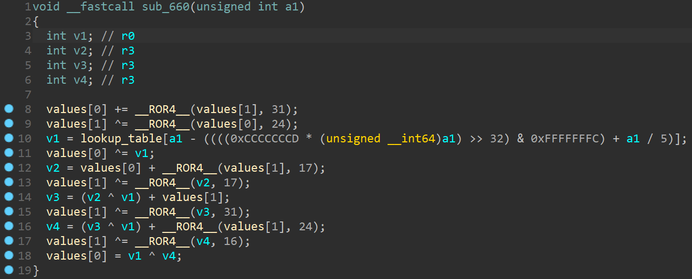
</div>
<br>

At this point, I was not able to guess the [CRAX Block Cypher algorithm](https://sparkle-lwc.github.io/crax), so I decided to rewrite the encryption function in Python and decrypt it by using z3.  

## Solving the encryption

### Dependency analysis

The encryption function's behavior indicates that each pair of new values depends solely on the two previously encrypted values and specific lookup values (located at `0x20001034` and `0xF98`), which likely function as part of an encryption key. From our initial observations noted in the overview, the first 800 hexadecimal characters of the output and the attached file are identical. This allows us to use the last 8 common bytes as a starting point for our encryption emulation.

### Z3 solver

To manage z3's memory constraints effectively, we opt to decrypt the data 8 bytes at a time. This strategy is efficient because knowing the previous 8 bytes enables z3 to decrypt the next 8 bytes within a reasonable timeframe.

```python
[...] # from z3_solve_next_two.py

# I only need the next 2 VALUES
LN = 2

screen_plain = [BitVec(f"screen_plain_{i}", 32) for i in range(LN)]
screen_cp = [x for x in screen_plain]
screen_enc = main_loop(screen_cp)

s = Solver()
for i in range(LN):
    s.add(screen_enc[i] == screen_out[i + OFFSET])

if s.check() == sat:
    print("SAT!")
    m = s.model()
    print(", ".join([hex(m[screen_plain[i]].as_long()) for i in range(LN)]))
```
<br>

Given the slow performance of the decryption script and the prevalence of zeros in the decrypted data, we can refine the script to first check if the decrypted 8 bytes were zeros by encrypting them and comparing the result to the encrypted data. If they did not match, only then would we employ z3 for decryption.

```python
[...] # from solve.py

# first 800 hex_char (= 400 bytes = 100 _DWORD) are the same
OFFSET = 100
result = screen_in[:OFFSET]

# sub_600
VALUES = [140050, 6267691, 5949456, 4919]

# last known values after OFFSET
prev = [3983684781, 1999312935]

for i in range(0, 1024-OFFSET, 2):

    if execute_check_next_zeros():
        next_two = ['0x0', '0x0']

    else:
        next_two = execute_z3_solve_next_two(OFFSET+i, prev + VALUES)

    result += next_two
    prev = [screen_out[OFFSET+i], screen_out[OFFSET+i+1]]

[...]
```
<br>

### Patching the screen buffer

After approximately one hour of execution, the decrypted data was stored in the `screen_pl.py` file. Using *IDA Python*, we patch the binary to display what was on the screen prior to encryption, instead of the default cat image:

```python

# paste the screen_pl.py content here
> screen_pl = [...]

> SCREEN_ADDR = 0x20000004

> 
for i in range(0, len(screen_pl)):
    patch_byte(SCREEN_ADDR+i, screen_pl[i])

```
<br>

Upon executing the patched binary in QEMU, the display shows the flag:

<div style="text-align: center;">
    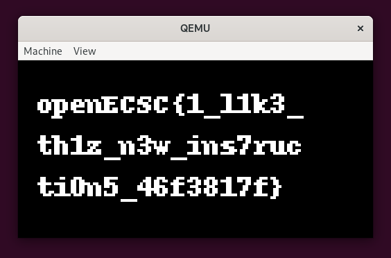
</div>


## Summary
This challenge revolves around an ARM kernel that encrypts the screen buffer, displaying encrypted data similar to the provided `out.enc` file on the console.

The initial step involves deobfuscating the binary. This is accomplished by tracing its execution using gdb-multiarch combined with QEMU's -S -s options, allowing for an in-depth analysis of the binary's operations. Key to this process is patching the undefined (UDF) instructions with appropriate handlers from the IRQ vector table. 

Through detailed examination of the pseudo-code, the encryption is identified as a CRAX Block Cipher algorithm.

To reverse the encryption, we can employ the CRAX Block Cipher's decryption function or, alternatively, we can reimplement the encrypt function in Python and decrypt the screen buffer with the z3 solver.

With the decryption complete, we patch the binary and run it in QEMU, revealing the flag on the screen buffer.

## Attachments
- [check_next_are_zeros.py](attachments/check_next_are_zeros.py)
- [out.py](attachments/out.py)
- [result.py](attachments/result.py)
- [screen_in.py](attachments/screen_in.py)
- [screen_pl.py](attachments/screen_pl.py)
- [solve.py](attachments/solve.py)
- [z3_solve_next_two.py](attachments/z3_solve_next_two.py)
