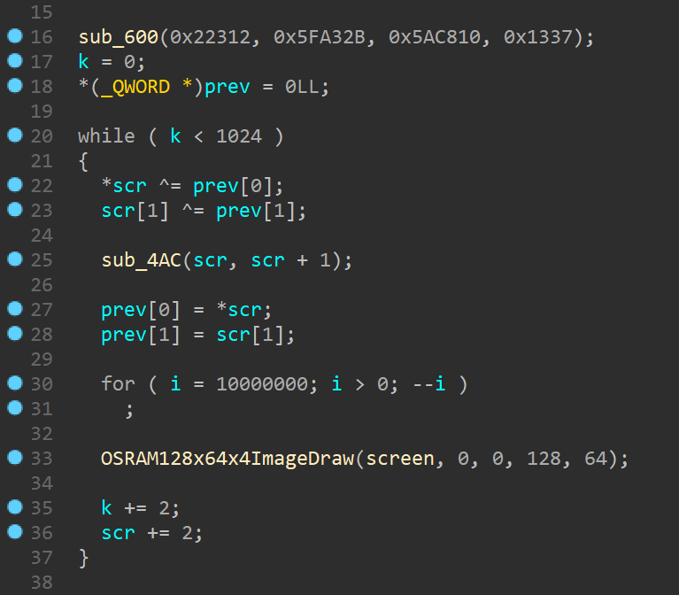

# openECSC 2024 - Round 2
## [rev] arxelerated (21 solves)

oh no, my device starts shredding everything I put in it...

```bash
$ qemu-system-arm -cpu cortex-m3 -machine lm3s6965evb -kernel arxelerated -semihosting -semihosting-config enable=on,target=native -serial mon:stdio
```

# INTRODUCTION

A really fun challenge about an obfuscated ARM kernel. It's an engaging puzzle for those familiar with firmware analysis.

**Note:** You can skip to the summary if you are not interested in the details.

# FIRST IMPRESSIONS

Upon examining the provided materials, we encounter two main files:

- `arxelerated`: A firmware file for ARM Cortex-M3.
- `out.enc`: An encrypted file, presumably containing data we need to decrypt.
Executing the firmware using the specified QEMU command reveals a beautifully rendered cat image.

By running the given QEMU command, we can see a beautiful cat image. 

<div style="text-align: center;">
    
</div>

When a key is entered, lot of dots are printed on the console while the image is being covered with random pixels. At the end, when the image is completely covered, a long hex string is printed on the console. 

<div style="text-align: center;">
    
</div>

```
>........[...].........
d0f5d8cadc1abc0b[...]6b6b33eb
```

The length of the hex string is the same as the one in the `out.enc` file and the first part of the string is the same as the one in the `out.enc` file.  
By executing the QEMU command multiple times, we can see that the hex string is the same every time. Therefore, the encryption is deterministic and we can assume that the `out.enc` file contains the encrypted data of something else, maybe the flag. 

# UNDERSTANDING THE FLOW

By executing the `file` command on the `arxelerated` file, we can see that it is an ARM ELF binary, statically linked and not stripped. 

```bash
$ file arxelerated
arxelerated: ELF 32-bit LSB executable, ARM, EABI5 version 1 (SYSV), statically linked, not stripped
```

By running the `strings` command on the binary, we can see that the binary is using the `Sourcery G++ 4.2-68` compiler and it is using some functions related to an OSRAM display. 

```bash
$ strings arxelerated | grep GCC
GCC: (Arm GNU Toolchain 13.2.rel1 (Build arm-13.7)) 13.2.1 20231009
GCC: (Sourcery G++ 4.2-68) 4.2.1
GCC: (Sourcery G++ 4.2-68) 4.2.1
GCC: (Sourcery G++ 4.2-68) 4.2.1
GCC: (Sourcery G++ 4.2-68) 4.2.1

$ strings arxelerated | grep OSRAM
OSRAMWriteCommand
OSRAMWriteData
g_pucOSRAM128x64x4VerticalInc
g_pucOSRAM128x64x4HorizontalInc
g_pucOSRAM128x64x4Init
OSRAM128x64x4Clear
OSRAM128x64x4ImageDraw
OSRAM128x64x4Enable
```

We can open the binary in IDA PRO with the `ARM little-endian` processor type and see what we can find out. 

<div style="text-align: center;">
    
</div>

The main function is quite simple. It initializes the system and the `__data_start__`. Then, it calls the `sub_504` function.  

<div style="text-align: center;">
    
</div>

By analyzing this function, we can see that it calls the following functions:
1. `sub_474`, which initializes other the clock and the display;
2. `OSRAM128x64x4ImageDraw(&unk_20000004, 0, 0, 128, 64);` which, we can assume, draws the cat image on the display;
3. `UARTCharPut(0x4000C000, '>');` which prints the `>` character on the console;
4. `UARTCharGet(0x4000C000);` which waits for a character from the console;
5. `__und(0);` which is an undefined instruction, so the program will get some exception here. 

Because of the *UND* instruction, we can not understand what the program does only by a static analysis. Let's use GDB to debug the binary and see what is happening.  
We add `-S -s` to the QEMU command to freeze the CPU at startup and wait for a GDB connection. Then, we open GDB and connect to the QEMU instance. 

```bash
$ qemu-system-arm -cpu cortex-m3 -machine lm3s6965evb -kernel arxelerated -semihosting -semihosting-config enable=on,target=native -serial mon:stdio -S -s
```

```
$ gdb-multiarch 
[...]

> file arxelerated
[...]

> target remote localhost:1234
[...]

> break *0x54A
[...]

> continue
[...]

> x/i $pc
=> 0x54a <frame_dummy+290>:     udf     #0

> next
[...]

> x/i $pc
=> 0x6cc <frame_dummy+676>:     tst.w   lr, #4
```

We can see that the program jumps to the `sub_6CC` function that handles the interrupt, like an ***Interrupt Service Routine***. Here, the Current Program Status Register (CPSR) is saved and it is used to call a function pointed by `off_F80`. We can assume that this is the ***IRQ vector table***.

<div style="text-align: center;">
    
</div>


In this case, when the execution reaches the BLX instruction at `0x708`, we can see that the program jumps to the `sub_600` function, which is the first function in the IRQ vector table:

```
> break *0x708
[...]

> continue
[...]

> x/i $pc
=> 0x708 <frame_dummy+736>:     blx     r5

> next
[...]

> x/i $pc
=> 0x600 <frame_dummy+472>:     push    {r4}
```


We can guess that the immediate value passed to the UND instruction is the index of the function in the IRQ vector table.
By using IDA python, we can extract all the addresses where there is a UND instruction to see if the guess is true.

```python
> 
def get_und_addresses():
    addresses = []
    for i in range(0x0, 0x1000):
        if get_bytes(i, 1) == b'\xde':
            addresses.append(i-1)
    print("UND addresses:")
    print(list(map(hex, addresses)))
    return addresses

def get_und_arguments():
    addresses = get_und_addresses()
    arguments = []
    for address in addresses:
        arguments.append(get_operand_value(address, 0))
    return arguments

def print_und_handlers():
    arguments = get_und_arguments()
    print("UND arguments:")
    print(list(map(hex, arguments)))

> print_und_handlers()

UND addresses:
['0x4c0', '0x4ce', '0x4d8', '0x4f0', '0x4fa', '0x54a', '0x6e0', '0x774']
UND arguments:
['0x1', '0x3', '0x4', '0x3', '0x2', '0x0', '0xff', '0xff']
```

If we put a breakpoint to this addresses, we can see that the program jumps to the functions pointed by the IRQ vector table at the corresponding index (except for 0xff arguments, whose instruction are never reached). So the guess was correct.
Furthermore, we can notice that when the program jumps to the functions in the IRQ vector table, the registers are the same as the ones during the UND instruction. 

# DEOBFUSCATION

To see some nice pseudo-code from the callers, we need to patch the UND instructions with a call to the corresponding function.  
The problem is that BL instruction is 4 bytes long, while the UND instruction is 2 bytes long. By double-clicking the addresses in the IDA python console, we can inspect the UND instructions and see that most of the time they are preceded by the useless instruction `MOV r3, r3`. Therefore, we can use this space to insert the BL instruction.  
The BL instruction is PC-relative, so we need to calculate the offset between the UND instruction and the function we want to call. 

```python
> IRQ_table_addr = 0xF80
> IRQ_table = [0x600 + int.from_bytes(get_bytes(IRQ_table_addr + i*4, 1), 'big') - 1  for i in range(0, 5)]

> UND_addresses = get_und_addresses()
> MOV_R3_R3_bytes = get_bytes(0x4CC, 2)
> patchable_UND_addrs = [addr for addr in UND_addresses if get_bytes(addr-2, 2) == MOV_R3_R3_bytes]
> patchable_UND_args = [get_operand_value(addr, 0) for addr in patchable_UND_addrs]

> 
def calculate_BL_bytes(source, destination):
    source = source + 4
    offset = destination - source
    offset = (offset >> 1) & 0x00FFFFFF
    imm11 = offset & 0x07FF

    S = (offset >> 24) & 0x1
    J1 = not(S ^ ((offset >> 22) & 0x1))  
    J2 = not(S ^ ((offset >> 23) & 0x1))

    high_halfword = 0xF000 | (S << 10)
    low_halfword = 0xD000 | ((J1 & 0x1) << 13) | ((J2 & 0x1) << 11) | imm11

    return high_halfword.to_bytes(2, byteorder='little') + low_halfword.to_bytes(2, byteorder='little')

def patch_UNDs():
    for addr, arg in zip(patchable_UND_addrs, patchable_UND_args):
        print("Patching UND at", hex(addr), "with argument", hex(arg))
        print("Calling function at", hex(IRQ_table[arg]))
        BL_bytes = calculate_BL_bytes(addr-2, IRQ_table[arg])
        for i in range(0, 4):
            patch_byte(addr-2+i, BL_bytes[i])

> patch_UNDs()

```

We can see modifications in the code, but we need to patch the 0x4C0 UND before seeing the pseudo-code.  
Here, there is no obvious useless instruction before the UND instruction, so we need to find some space to insert the BL instruction.

```
.text:000004AC                 PUSH    {R4-R6,LR}
.text:000004AE                 MOV     R6, R0
.text:000004B0                 MOV     R5, R1
.text:000004B2                 LDR     R2, [R0]
.text:000004B4                 LDR     R3, [R1]
.text:000004B6                 MOV     R0, R2
.text:000004B8                 MOV     R1, R3
.text:000004BA                 MOVS    R4, #0
.text:000004BC                 MOV     R2, R4
.text:000004BE                 MOV     R3, R4
.text:000004C0                 UND     #1
```


As we can see, the registers R2 and R3 are used to store values pointed by R0 and R1, but then they are overwritten with R4. 
We can load those values directly into R0 and R1 without wasting instructions, by patching the binary like this:

```
.text:000004AC                 PUSH    {R4-R6,LR}
.text:000004AE                 MOV     R6, R0
.text:000004B0                 MOV     R5, R1
.text:000004B2                 LDR     R0, [R0]        ; a1
.text:000004B4                 LDR     R1, [R1]        ; a2
.text:000004B6                 MOVS    R4, #0
.text:000004B8                 MOV     R2, R4
.text:000004BA                 MOV     R3, R4
.text:000004BC                 NOP
.text:000004BE                 BL      sub_614
```

After updating the interested code with the shortcuts `U`, `C`and `P`, we can see the pseudo-code of the functions `sub_504` and `sub_4AC`:

<div style="display: flex; justify-content: space-between;">
    
    
</div>

And now the challenge begins.

# REVERSE ENGINEERING

We can give a better look to the `sub_504` function, which is the function called by the `start` function:
- *Initialization*:
<div style="text-align: center;">
    
</div>
<br>

- *Main Loop*:
<div style="text-align: center;">
    
</div>
<br>

- *Outputing*:
<div style="text-align: center;">
    
</div>

## Main Loop

The loop takes two consecutive 4 byte values from the screen buffer and xors them with the two previous calculated values (initially zero). Then, it calls the `sub_4AC` function with the result and updates the *prev* values.  
After that, it performs a sleep, draws the new screen buffer and updates the indexes.  

By analyzing the `sub_4AC` function, we can see that it is an encryption function that performs xor and ror operations on the input values by calling the IRQ vector table functions, including the `sub_660` function, while printing ten dots on the console. 

<div style="text-align: center;">
    
</div>

At this point, I was not able to guess the [CRAX Block Cypher algorithm](https://sparkle-lwc.github.io/crax), so I decided to rewrite the encryption function in Python and decrypt it by using z3.  

# SOLVING

By analyzing the encryption function, we can see that the next 2 values depend only on the 2 previously encrypted values and some lookup values (at 0x20001034 and 0xF98,probably some sort of an encryption key).  
Furthermore, as we said in the overview section, the first 800 hex char are the same for the actual output and the one given as attachment. So, we can use that last 8 bytes to start our encryption emulation.

Instead of decrypting all at once, I decrypted 8 bytes at a time, in order to avoid the memory limit of z3. In fact, by having the previous 8 bytes, z3 is able to decrypt the next 8 bytes in a reasonable time.  

```python
[...] # from z3_solve_next_two.py

# I only need the next 2 VALUES
LN = 2

screen_plain = [BitVec(f"screen_plain_{i}", 32) for i in range(LN)]
screen_cp = [x for x in screen_plain]
screen_enc = main_loop(screen_cp)

s = Solver()
for i in range(LN):
    s.add(screen_enc[i] == screen_out[i + OFFSET])

if s.check() == sat:
    print("SAT!")
    m = s.model()
    print(", ".join([hex(m[screen_plain[i]].as_long()) for i in range(LN)]))
```

Even by solving for 2 values at a time, the script was quite slow and I saw that the decrypted data was quite full of zeros. Therefore, I changed the solve script in order to check if the decrypted 8 bytes where zeros by encrypting them and comparing the result with the encrypted data. Only if the encrypted data does not match, I calculate them with z3. 

```python
[...] # from solve.py

# first 800 hex_char (= 400 bytes = 100 _DWORD) are the same
OFFSET = 100
result = screen_in[:OFFSET]

# sub_600
VALUES = [140050, 6267691, 5949456, 4919]

# last known values after OFFSET
prev = [3983684781, 1999312935]

for i in range(0, 1024-OFFSET, 2):

    if execute_check_next_zeros():
        next_two = ['0x0', '0x0']

    else:
        next_two = execute_z3_solve_next_two(OFFSET+i, prev + VALUES)

    result += next_two
    prev = [screen_out[OFFSET+i], screen_out[OFFSET+i+1]]

[...]
```

After 1 hour of execution, we got the decrypted data in the `screen_pl.py` file. Now, we can use it to patch the binary to see what was showing the screen before the encryption instead of the cat image. We can use IDA python to patch the binary:

```python

# paste the screen_pl.py content here
> screen_pl = [...]

> SCREEN_ADDR = 0x20000004

> 
for i in range(0, len(screen_pl)):
    patch_byte(SCREEN_ADDR+i, screen_pl[i])

```

After applying the patches to the input file, we can run it in QEMU and see that the screen is showing the flag.

<div style="text-align: center;">
    
</div>


# SUMMARY
The challenge consists of an ARM kernel that encrypts the screen buffer and prints on the console the encrypted data that is similar to the given `out.enc` file.

In order to solve it, we need to deobfuscate the binary by understanding the flow with `gdb-multiarch` and QEMU's `-S -s` options. Then, we can patch the UND instructions with the right handlers in the IRQ vector table.  

Once we have the pseudo-code, we can analyze the encryption function to find out that it is a CRAX Block Cypher algorithm.

To decrypt the screen buffer, we can use the decryption function of the CRAX Block Cypher algorithm or we can rewrite it in Python and decrypt it with z3.

Once we have the decrypted screen buffer, we can patch the binary and run it in QEMU to see the flag.


